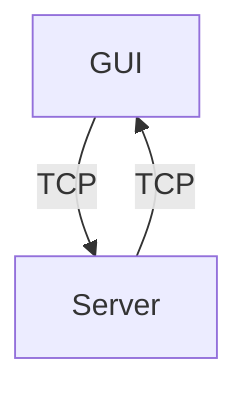

# Projet Zappy - Partie GUI

## Introduction

Le projet Zappy est un jeu en réseau où plusieurs équipes s'affrontent sur une carte composée de cases contenant des ressources. Le serveur, codé en C, gère le monde du jeu, les interactions des joueurs, et la communication avec les interfaces graphiques (GUI) et les IA.

## Installation

### Prérequis

Le GUI Zappy utilise la bibliothèque `raylib` pour avoir un rendu en 3D. Vous devez
installer cette bibliothèque avant de compiler le projet.

#### Debian/Ubuntu

```sh
sudo apt install libraylib-dev
```

#### Fedora

```sh
sudo dnf install raylib
```

#### Arch Linux

```sh
sudo pacman -S raylib
```

### Compilation

Pour compiler le serveur, le GUI et les clients IA, exécutez la commande suivante à la racine du projet :

```sh
make
```

## Architecture

### Structure du Répertoire

```

.
├── assets
│   ├── (Assets utilisés dans le projet)
|
├── Makefile
└── src
    ├── Collector
    │   ├── AnimationCollector.cpp
    │   ├── ModelCollector.cpp
    │   └── TextureCollector.cpp
    ├── core
    │   ├── CameraController.cpp
    │   ├── Egg.cpp
    │   ├── Game.cpp
    │   ├── GameException.cpp
    │   ├── GameSocket
    │   │   ├── GameSocket.cpp
    │   │   └── ReactionFunc.cpp
    │   ├── Island.cpp
    │   ├── Map.cpp
    │   ├── ModelLoader.cpp
    │   ├── Object3D.cpp
    │   └── Player
    │       └── Player.cpp
    ├── main.cpp
    ├── Manager
    │   ├── CameraManager.cpp
    │   ├── ChatManager.cpp
    │   ├── RayManager.cpp
    │   ├── ShaderManager.cpp
    │   └── UIManager.cpp
    ├── Menu
    │   ├── Button.cpp
    │   ├── endMenu.cpp
    │   ├── loading.cpp
    │   ├── LoadingMenu.cpp
    │   └── menu.cpp
    ├── Settings
    │   └── settings.cpp
    ├── Sky
    │   └── Sky.cpp
    ├── Socket
    │   └── SocketManager.cpp
    ├── Utils
    │   └── utils.cpp
    └── Wrapper
        ├── Raylib
        │   ├── RLAnimation.cpp
        │   ├── RLModel.cpp
        │   ├── RLRay.cpp
        │   ├── RLShader.cpp
        │   ├── RLText.cpp
        │   └── RLWindow.cpp
        └── SocketWrapper.cpp

├── GUI
    ├── ArgumentException.hpp
    ├── Collector
    │   ├── AnimationCollector.hpp
    │   ├── ModelCollector.hpp
    │   └── TextureCollector.hpp
    ├── core
    │   ├── CameraController.hpp
    │   ├── Egg.hpp
    │   ├── GameException.hpp
    │   ├── Game.hpp
    │   ├── Island.hpp
    │   ├── Map.hpp
    │   ├── ModelLoader.hpp
    │   ├── Object3D.hpp
    │   └── Player
    │       ├── Orientation.hpp
    │       └── Player.hpp
    ├── gui.hpp
    ├── Manager
    │   ├── CameraManager.hpp
    │   ├── ChatManager.hpp
    │   ├── RayManager.hpp
    │   ├── ShaderManager.hpp
    │   └── UIManager.hpp
    ├── Menu
    │   ├── Button.hpp
    │   ├── endMenu.hpp
    │   ├── loading.hpp
    │   ├── LoadingMenu.hpp
    │   └── menu.hpp
    ├── Settings
    │   └── settings.hpp
    ├── Sky
    │   └── Sky.hpp
    ├── Socket
    │   └── SocketManager.hpp
    ├── Utils
    │   └── utils.hpp
    └── Wrapper
        ├── Raylib
        │   ├── RLAnimation.hpp
        │   ├── RLModel.hpp
        │   ├── RLRay.hpp
        │   ├── RLShader.hpp
        │   ├── RLText.hpp
        │   └── RLWindow.hpp
        └── SocketWrapper.hpp

```

### Description des Composants

- **Core** : Contient tout les fichiers principaux du GUI tel que les gestion des
commandes envoyées par le server, le fonctionnement des joueurs, de la map et des ressources.
- **Collector** : Contient des gestionnaires pour la collecte et la gestion des ressources nécessaires à l'interface graphique.
- **Manager** : Contient des gestionnaires pour divers aspects de l'interface graphique.
- **Menu** : Contient les éléments pour les différents menus du jeu.
- **Settings** : Gère les paramètres du jeu.
- **Socket** : Gestion des communications réseau.
- **Utils** : Contient des fonctions utilitaires pour diverses opérations.
- **Wrapper** : Contient des wrappers pour la bibliothèque Raylib, facilitant l'utilisation et l'encapsulation des fonctionnalités Raylib dans le projet.

### Schéma de Communication



Le GUI communique avec le server via des sockets TCP pour recevoir les information concernant l'état du jeu. Le Server envoie des commandes au GUI et le GUI affiche les évenements en conséquence. Par exemple si un player se déplace, le server notifie le GUI pour pouvoir faire avancer le player visuéllement. Le GUI peut aussi envoyer des commandes au server pour demander informations sur l'état de jeu.

### Connection au server

la classe `SocketManager` permet de créer un socket, de se connecter au server, recevoir les commande du server et lui en envoyer :

```cpp
class SocketManager {
public:
    using MessageHandler = std::function<void(const std::string&)>;

    SocketManager();
    SocketManager(const std::string& host, int port);
    ~SocketManager();

    void Connect();
    void Disconnect();
    void SendMessage(const std::string& message);
    std::string SendCommand(const std::string& command);
    std::string ReceiveMessage();
    bool TryReceiveMessage(std::string& message);
    void SetMessageHandler(MessageHandler handler);
    bool IsRunning() const;
    void Setwin();

private:
    void ReceiveMessages();

    std::string host;
    int port;
    int sockfd;
    std::thread receiveThread;
    std::mutex messageMutex;
    std::queue<std::string> messageQueue;
    std::condition_variable messageCondition;
    MessageHandler messageHandler;
    bool running;
    bool waitingForResponse;
    std::string response;
    bool iswin;
    SocketWrapper socketWrapper;
};
```

#### Explication de la classe `SocketManager`


- **Connect()** : Établit une connexion avec le serveur en utilisant les informations d'hôte et de port spécifiées.
- **Disconnect()** : Ferme la connexion avec le serveur et termine le thread de réception.
- **SendMessage(const std::string& message)** : Envoie un message brut au serveur.
- **SendCommand(const std::string& command)** : Envoie une commande au serveur et attend une réponse synchronisée.
- **ReceiveMessage()** : Récupère et renvoie le prochain message reçu dans la file d'attente.
- **TryReceiveMessage(std::string& message)** : Essaye de récupérer un message de la file d'attente sans bloquer.
- **SetMessageHandler(MessageHandler handler)** : Définit le gestionnaire de messages pour traiter les messages reçus du serveur.
- **IsRunning() const** : Vérifie si la connexion est toujours active.
- **Setwin()** : Marque la fin de la connexion avec le serveur.
- **ReceiveMessages()** : Fonction exécutée dans un thread séparé pour recevoir les messages du serveur de manière asynchrone.

### Gestion des commandes du server

Quand le GUI va recevoir une commande du server, il va regarder si la commande est connu en passant dans un tableau de commande, si la commande existe alors il execute la fonction en consequence.

```cpp
void Game::InitializeCommandHandlers() {
    commandHandlers = {
        {"msz", [this](std::istringstream& iss) { HandleMapSize(iss); }},
        {"bct", [this](std::istringstream& iss) { HandleTileContent(iss); }},
        {"tna", [this](std::istringstream& iss) { HandleTeamName(iss); }},
        {"pnw", [this](std::istringstream& iss) { HandlePlayerNew(iss); }},
        {"ppo", [this](std::istringstream& iss) { HandlePlayerPosition(iss); }},
        {"plv", [this](std::istringstream& iss) { HandlePlayerLevel(iss); }},
        {"pin", [this](std::istringstream& iss) { HandlePlayerInventory(iss); }},
        {"pex", [this](std::istringstream& iss) { HandlePlayerExpulsion(iss); }},
        {"pbc", [this](std::istringstream& iss) { HandlePlayerBroadcast(iss); }},
        {"pic", [this](std::istringstream& iss) { HandleStartIncantation(iss); }},
        {"pie", [this](std::istringstream& iss) { HandleEndIncantation(iss); }},
        {"pfk", [this](std::istringstream& iss) { HandleEggLaying(iss); }},
        {"pdr", [this](std::istringstream& iss) { HandlePlayerDrop(iss); }},
        {"pgt", [this](std::istringstream& iss) { HandlePlayerTake(iss); }},
        {"pdi", [this](std::istringstream& iss) { HandlePlayerDeath(iss); }},
        {"enw", [this](std::istringstream& iss) { HandleEggLayingPlayer(iss); }},
        {"ebo", [this](std::istringstream& iss) { HandleEggConnection(iss); }},
        {"edi", [this](std::istringstream& iss) { HandleEggDeath(iss); }},
        {"sgt", [this](std::istringstream& iss) { HandleTimeUnitChange(iss); }},
        {"sst", [this](std::istringstream& iss) { HandleTimeUnitChange(iss); }},
        {"seg", [this](std::istringstream& iss) { HandleGameOver(iss); }},
    };
}
```

## Lancer le GUI

Pour lancer le GUI vous devez d'abord lancer le server pour pouvoir vous y connecter.
Une fois connecter au server, utilisé la commande suivante pour lancer le GUI :

```sh
./zappy_gui -p port -h machine
```

### Options

- `-p port` : Port sur lequel est le server.
- `-h machine` : nom du host du server (localhost par defaut).

Par exemple, si le server est connecté sur le port 4242 sur le localhost vous devez utiliser cette commande :

```sh
./zappy_gui -p 4242 -h localhost
```

## Conclusion

Cette documentation détaille la mise en œuvre de la partie graphique (GUI) du projet Zappy d'Epitech. En se concentrant sur la gestion de la connexion au serveur et le traitement des commandes échangées, elle fournit un aperçu complet de la façon dont l'interface utilisateur interagit avec le backend du jeu.
