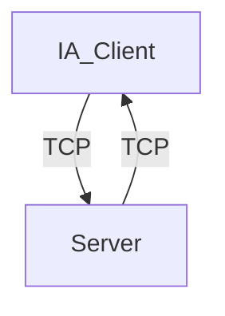

# Projet Zappy - Partie IA

## Introduction

Le projet Zappy est un jeu en réseau où plusieurs équipes s'affrontent sur une carte composée de cases contenant des ressources. Le serveur, codé en C, gère le monde du jeu, les interactions des joueurs, et la communication avec les interfaces graphiques (GUI) et les IA.

## Architecture

### Structure du Répertoire

```
.
├── Makefile
└── src
    ├── main.py
    ├── InventoryManager.py
    ├── Command.py
    └── utils.py

```

### Description des Composants

- **main.py** : Contient les boucles principales de jeux. Elles permettent d'envoyer au serveur des commandes.
- **Command.py** : Contient les commandes spécifiques à envoyer au serveur ainsi que le traitement de ses réponses.
- **InventoryManager.py** : Contient les inventaires du joueur, son inventaire partagé ainsi que son inventaire objectif.
- **utils.py** : Contient des fonctions utilitaires.

### Schéma de Communication



L'IA communique avec le serveur en utilisant des sockets TCP. Ils envoient des commandes pour interagir avec le jeu, et reçoit les réponses du serveur suites à leurs commandes.

### Commandes de l'IA

#### Listes de commandes éxécutables

Pour communiquer avec le serveur, les différentes IA ne peuvent envoyer que certaines commandes, contenu dans cette liste:

- **Forward\n**: Permet de faire avancer une IA d'une case sur la map dans la direction où il regarde.
- **Right\n**: Permet de faire pivoter un joueur de 90° à droite.
- **Left\n**: Permet de faire pivoter un joueur de 90° à gauche.
- **Look\n**: Permet d'obtenir un liste d'éléments que le joueur voit sur les cases de la map qui sont devant lui.
- **Inventory\n**: Fais une liste des objets que le player possède dans son inventaire.
- **Broadcast text\n**: Envoie le message "text" (modifiable) à tous les autres joueurs sur la map.
- **Connect_nbr\n**: Envoie le nombre de places disponibles dans la team du joueur.
- **Fork\n**: Rajoute une place dans la team du joueur.
- **Eject\n**: Ejecte tout les joueurs d'une case sauf le joueur qui à lancé la commande.
- **Take object\n**: Prends un objet présent sur la map et le mets dans l'inventaire du joueur (liste les objets disponibles: food, linemate, sibur, phiras, thystame, mendiane, deraumere).
- **Set object\n**: Prends un objet présent dans l'inventaire du joueur et le mets sur l'endroit de la map où le joueur est présent (liste les objets disponibles: food, linemate, sibur, phiras, thystame, mendiane, deraumere).
- **Incantation\n**: Lance une incantation qui fait passer tout les players présents sur la case au niveau supérieur.

#### Réponses du serveur

Pour la plupart des commandes les IA reçoivent "ok\n" en cas de réussite ou "ko\n" en cas d'échecs de la commande sauf pour les cas suivant:

- **Look\n**: [tile1, tile2,...] où tile1 représente la liste des éléments présents sur l'élément 1 de la map par rappot au joueur(IA).
- **Inventory\n**: [linemate n, sibur n,...]. L'entier n représente le nombre d'éléments que possède le joueur par rapport à un élément précisé avant.
- **Connect_nbr\n**: value. Value représente le nombre de slots disponibles dans la team.
- **Incantation\n**: "Elevation underway" -> "Current level: k". Dans un premier temps le joueur qui lance la commande envoie un message et ensuite l'entier k désigne le niveau auquel le joueur est après l'incantation.

### Stratégie de l'IA

Pour optimiser la montée en niveau de nos IA dans le projet Zappy, nous avons adopté une stratégie collective qui consiste à passer du niveau 2 au niveau 8 ensemble. Cette approche repose sur un système de "Shared Inventory" (Inventaire Partagé), permettant à chaque IA de partager les ressources avec les autres membres de l'équipe.

Lorsque les IA se regroupent sur une même case, elles auront ensemble plus ou exactement le nombre nécessaire de matériaux requis pour monter au niveau 8. Cette méthode garantit une répartition efficace des ressources et favorise une progression synchronisée de toutes les IA vers les niveaux supérieurs. La stratégie se repose donc sur plusieurs points :

- **Coordination Collective** : Toutes les IA travaillent de manière synchronisée pour atteindre les niveaux supérieurs ensemble.

- **Inventaire Partagé** : Un système d'inventaire commun permettant de centraliser les ressources collectées par chaque IA.

- **Réunion Stratégique** : Les IA se rejoignent lorsque toutes les ressources ont été retrouvé sur une même case pour pouvoir tous passer du niveau 2 au niveau 8.

Cette stratégie vise à assurer une montée en niveau rapide et coordonnée, en maximisant l'efficacité des ressources disponibles.

### Commandes nécessaires au fonctionnement de l'IA

Pour que l'IA fonctionne de manière optimale dans le projet Zappy, nous avons besoin de certaines fonctions essentielles intégrées dans la boucle principale. Voici une description détaillée de ces fonctions et de leur rôle :

- **Initialisation** :
    `self.blockingBuffer()`
        Cette fonction permet de récupérer les réponses du serveur avant de procéder aux commandes, permettant à l'IA de disposer des informations nécessaires pour les actions à venir.
    `self.update_inventory()`
        Cette fonction met à jour l'inventaire de l'IA avec les ressources actuelles disponibles.

- **Corps de la Boucle** :
    C'est ici que l'on peut envoyer n'importe quel type de commande sous la forme `self.cmd.#command`
        Exemple de commande : `self.cmd.forward()`
            Cette commande fait avancer l'IA d'une case.

    Afin de récupérer les matériaux et ne pas mourir de faim, nous utilison un système de gestion des ressources :
        `self.eat_nearest_ressource("linemate", False)`
            Cette fonction utilise la réponse de la commande Look pour vérifier s'il y a des "linemates" ou de la nourriture à proximité.
            Si des ressources sont présentes sur plusieurs cases, l'IA se déplace vers ces cases et collecte les ressources nécessaires en une seule itération de boucle de jeu.

- **Finalisation** :
        `self.updateInfos()`
            Cette fonction exécute les commandes Look et Inventory pour obtenir une vue d'ensemble des ressources environnantes et de l'inventaire de l'IA.
        `self.cmd.sendArrayCmd()`
            Cette fonction envoie les commandes stockées dans un tableau. Le tableau ne se remplit que si des places sont disponibles et cesse de s'alimenter lorsqu'il contient 10 commandes.

### La gestion des réponses

Pour gérer efficacement les réponses du serveur dans le projet Zappy, nous utilisons un thread dédié qui s'occupe de la réception des messages. Ce thread fonctionne en boucle et analyse chaque message pour déterminer s'il s'agit d'un broadcast, d'une information d'eject, ou d'une commande.

```py
    thread_reception = threading.Thread(target=self.reception_loop)
    thread_reception.start()
```

```py
    if data == "dead":
        print("Dead then exit")
        os._exit(0)
    if not data:
        print("Déconnexion du serveur")
        os._exit(0)
    if data.startswith("message"):
        print("Le recv reçu est un broadcast")
        self.adjustBroadcast()
    elif data.startswith("eject"):
        print("Le recv reçu est un eject")
    else:
        print("Le recv reçu est la réponse d'une commande")
        ...
```

Pour gérer les réponses du serveur en lien avec les commandes envoyées, nous utilisons deux tableaux : l'un pour les commandes (`commandList`) et l'autre pour les réponses (`responseList`). Chaque fois qu'une commande est envoyée, elle est ajoutée à ces deux tableaux. Lorsqu'une réponse est reçue, elle correspond à la commande située à l'indice 0 du tableau ``responseList`. Grâce à cela, nous pouvons interpréter les réponses que l'on reçoit (comme par exemple envoyer un broadcast lorsqu'on reçoit "ok" pour la commande Take).
Afin de faire de la place au tableau de commandList, lorsqu'on reçoit une réponse, il est nécessaire de faire `self.commandWaitingRoom -= 1` afin de libérer une place.

```py
        ...
    else:
        print("Le recv reçu est la réponse d'une commande")
        if not self.responseList:
            return
        self.adjustData()
        if self.responseList[0] != "Incantation":
            self.commandWaitingRoom -= 1
        self.responseList.pop(0)
```

## Communication de l'IA

### Communication avec le serveur

La communication entre l'IA et le serveur se fait via des sockets TCP. Voici un exemple de séquence de communication :

1. **Connexion de l'IA** :
   - L'IA ouvre une socket sur le port du serveur.
   - Le serveur envoie un message de bienvenue.
   - L'IA envoie le nom de l'équipe.
   - Le serveur envoie le numéro de client et les dimensions du monde.

2. **Envoi de commandes** :
   - L'IA peut envoyer jusqu'à 10 commandes sans attendre de réponse.
   - Le serveur exécute les commandes dans l'ordre de réception et envoie des réponses de confirmation.

2. **Réception de réponse** :
   - L'IA récupère les réponses du serveur et agit en fonction de ce qui a été renvoyé.

## Lancer l'IA

Pour lancer l'IA, utilisez la commande suivante en spécifiant les options nécessaires :

```sh
./zappy_ai -p port -n team1 -h ip_adress
```

### Options

- `-p port` : Numéro de port pour le serveur.
- `-n team1` : Nom de l'équipe que l'IA souhaite rejoindre.
- `-h ip_adress` : L'adresse IP sur laquelle on souhaite se connecter

Par exemple, pour lancer une IA sur le port 8080 dans l'équipe "Team1", sur son adresse IP locale

```sh
./zappy_ai -p 8080 -n Team1 -c 3 -h 127.0.0.1
```

## Conclusion

Cette documentation couvre l'architecture de l'IA Zappy, la stratégie utilisée, et le protocole de communication avec le serveur. La stratégie de progression collective et d'inventaire partagé permet à nos IA de monter efficacement en niveau du 2 au 8. En centralisant les ressources et en favorisant la coordination, nous assurons une utilisation optimale des matériaux et une montée en niveau synchronisée de l'ensemble de nos IA. Cette approche collective est essentielle pour maximiser notre succès dans le projet.
