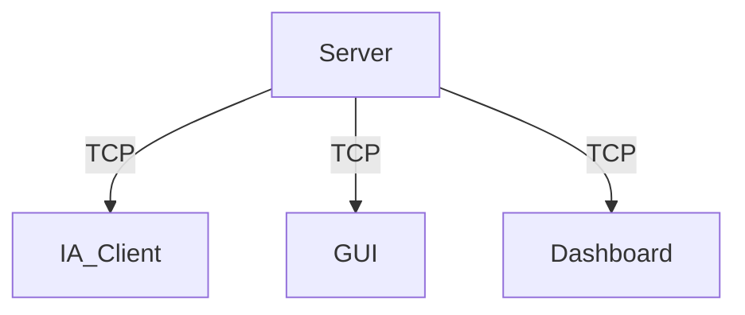

# Projet Zappy - Partie Serveur

## Introduction

Le projet Zappy est un jeu en réseau où plusieurs équipes s'affrontent sur une carte composée de cases contenant des ressources. Le serveur, codé en C, gère le monde du jeu, les interactions des joueurs, et la communication avec les interfaces graphiques (GUI) et les IA.

## Installation

### Prérequis

Le serveur Zappy utilise la bibliothèque `json-c` pour envoyer des informations au tableau de bord (dashboard). Vous devez installer cette bibliothèque avant de compiler le projet.

#### Debian/Ubuntu

```sh
sudo apt-get install libjson-c-dev
```

#### Fedora

```sh
sudo dnf install json-c-devel
```

### Compilation

Pour compiler le serveur, le GUI et les clients IA, exécutez la commande suivante à la racine du projet :

```sh
make
```

## Architecture

### Structure du Répertoire

```
.
├── Makefile
└── src
    ├── commands_gui
    │   ├── c_bct
    │   │   └── bct.c
    │   ├── c_ebo
    │   │   └── ebo.c
    │   ├── c_edi
    │   │   └── edi.c
    │   ├── c_enw
    │   │   └── enw.c
    │   ├── c_mct
    │   │   └── mct.c
    │   ├── c_msz
    │   │   └── msz.c
    │   ├── c_pbc
    │   │   └── pbc.c
    │   ├── c_pdi
    │   │   └── pdi.c
    │   ├── c_pdr
    │   │   └── pdr.c
    │   ├── c_pex
    │   │   └── pex.c
    │   ├── c_pfk
    │   │   └── pfk.c
    │   ├── c_pgt
    │   │   └── pgt.c
    │   ├── c_pic
    │   │   └── pic.c
    │   ├── c_pie
    │   │   └── pie.c
    │   ├── c_pin
    │   │   └── pin.c
    │   ├── c_plv
    │   │   └── plv.c
    │   ├── c_pnw
    │   │   └── pnw.c
    │   ├── c_ppo
    │   │   └── ppo.c
    │   ├── c_sbp
    │   │   └── sbp.c
    │   ├── c_seg
    │   │   └── seg.c
    │   ├── c_sgt
    │   │   └── sgt.c
    │   ├── c_smg
    │   │   └── smg.c
    │   ├── c_sst
    │   │   └── sst.c
    │   ├── c_suc
    │   │   └── suc.c
    │   └── c_tna
    │       └── tna.c
    ├── commands_ia
    │   ├── c_broadcast_txt
    │   │   └── broadcast_txt.c
    │   ├── c_connect_nbr
    │   │   └── connect_nbr.c
    │   ├── c_eject
    │   │   └── eject.c
    │   ├── c_fork
    │   │   └── fork.c
    │   ├── c_forward
    │   │   ├── forward.c
    │   │   └── moove.c
    │   ├── c_incantation
    │   │   ├── incantation.c
    │   │   └── start_incantation.c
    │   ├── c_inventory
    │   │   └── inventory.c
    │   ├── c_left
    │   │   └── left.c
    │   ├── c_look
    │   │   ├── gestion_coor.c
    │   │   ├── gestion_first_coor.c
    │   │   ├── gestion_str.c
    │   │   └── look.c
    │   ├── c_right
    │   │   └── right.c
    │   ├── c_set_obj
    │   │   └── set_obj.c
    │   └── c_take_obj
    │       └── take_obj.c
    ├── dashboard
    │   ├── get_usage.c
    │   └── send_info.c
    ├── init
    │   ├── generator
    │   │   ├── display_map.c
    │   │   ├── generator_map.c
    │   │   └── init_map.c
    │   └── init_struct.c
    ├── main.c
    ├── parsing
    │   ├── error.c
    │   └── parsing.c
    ├── run_commands
    │   ├── run_commands_dashboard.c
    │   ├── run_commands_gui.c
    │   └── run_commands_ia.c
    ├── server
    │   ├── config.c
    │   ├── handle.c
    │   ├── handle_cmd.c
    │   ├── init.c
    │   ├── server.c
    │   └── server_usage.c
    └── utils
        ├── commands
        │   ├── add_command.c
        │   ├── get_command.c
        │   ├── get_tick_for_command.c
        │   ├── print_command.c
        │   └── remove_command.c
        ├── elevation
        │   ├── add_elevation.c
        │   ├── get_elevation.c
        │   ├── init_elevation.c
        │   └── print_elevation.c
        ├── error.c
        ├── garbage_collector.c
        ├── get_rsc_code.c
        ├── init.c
        ├── map.c
        ├── my_strdup.c
        ├── players
        │   ├── create_player.c
        │   ├── display_player.c
        │   ├── get_player.c
        │   └── remove_player.c
        ├── progress_incantation
        │   ├── add_progress_incantation.c
        │   ├── get_progress_incantation.c
        │   └── remove_progress_incantation.c
        ├── refill.c
        ├── signal.c
        ├── split_buffer.c
        ├── team
        │   ├── add_team.c
        │   ├── create_team.c
        │   ├── egg_team.c
        │   └── get_team.c
        ├── tick.c
        └── tiredness.c

include
   ├── all.h
   ├── commands.h
   ├── elevation.h
   ├── map.h
   ├── parsing.h
   ├── progress_incantation.h
   ├── server.h
   ├── struct.h
   ├── utils.h
   └── web_debug.h

```

### Description des Composants

- **commands_gui** : Contient les commandes spécifiques pour l'interface graphique (GUI).
- **commands_ia** : Contient les commandes spécifiques pour les clients IA.
- **dashboard** : Contient les fichiers pour envoyer des informations de débogage et de performance au tableau de bord.
- **init** : Contient les fichiers pour initialiser les structures et la carte du jeu.
- **main.c** : Point d'entrée principal du serveur.
- **parsing** : Contient les fichiers pour analyser les arguments en ligne de commande.
- **run_commands** : Contient les fichiers pour exécuter les commandes reçues des clients GUI et IA.
- **server** : Contient les fichiers pour gérer les configurations et le fonctionnement du serveur.
- **utils** : Contient des fichiers utilitaires pour diverses fonctions telles que la gestion des joueurs, des équipes, des incantations, et des commandes.

### Schéma de Communication



Le serveur communique avec les clients IA, le GUI et le dashboard en utilisant des sockets TCP. Les clients IA envoient des commandes pour interagir avec le jeu, le GUI reçoit des mises à jour en temps réel sur l'état du jeu, et le dashboard reçoit des informations de débogage et des statistiques de performance.

### Structure Principale `struct_t`

La structure `struct_t` contient tous les éléments nécessaires à la gestion du serveur et du jeu. Voici une description détaillée de ses composants :

```c
typedef struct struct_s {
    int port;
    int map_width;
    int map_height;
    int client_nb;
    int time;
    int fd_gui;
    int fd_dashboard;
    char *obj;
    bool stop_server;
    bool start_game;
    char *look_str;
    int nb_tick_refill;
    int len_view;
    int view_num;
    map_element_t **map;
    player_t *head_player;
    int next_id_player;
    team_t *head_team;
    int next_id_team;
    elevation_t *head_elevation;
    clock_t clock;
    command_t *command_ticks;
    incantation_t *head_progress_incantation;
    dashboard_t *dashboard;
} struct_t;
```

#### Explication des Éléments de `struct_t`

- **port** : Numéro de port pour le serveur.
- **map_width** : Largeur de la carte du jeu.
- **map_height** : Hauteur de la carte du jeu.
- **client_nb** : Nombre de clients connectés.
- **time** : Temps de jeu.
- **fd_gui** : Descripteur de fichier pour le GUI.
- **fd_dashboard** : Descripteur de fichier pour le dashboard (optionnel).
- **obj** : Objet courant.
- **stop_server** : Booléen indiquant si le serveur doit s'arrêter.
- **start_game** : Booléen indiquant si le jeu a commencé.
- **look_str** : Chaîne de caractères pour la commande "look".
- **nb_tick_refill** : Nombre de ticks avant de remplir la carte avec des ressources.
- **len_view** : Longueur de la vue des joueurs.
- **view_num** : Nombre de vues.
- **map** : Pointeur vers une structure représentant la carte du jeu.
- **head_player** : Pointeur vers la liste chaînée des joueurs.
- **next_id_player** : Prochain ID de joueur disponible.
- **head_team** : Pointeur vers la liste chaînée des équipes.
- **next_id_team** : Prochain ID d'équipe disponible.
- **head_elevation** : Pointeur vers la liste chaînée des incantations.
- **clock** : Temps pour exécuter les commandes.
- **command_ticks** : Commandes avec ticks.
- **head_progress_incantation** : Pointeur vers les incantations en cours.
- **dashboard** : Pointeur vers les informations du tableau de bord (optionnel).

#### Explication des Éléments de `map_element_t`

Pour gérer notre map nous utilisons un tableau de structure :

```c
typedef struct map_element_s {
    int food;
    int linemate;
    int deraumere;
    int sibur;
    int mendiane;
    int phiras;
    int thystame;
    int nb_mob;
    int *id_mob;
} map_element_t;
```

Chaque élément (case de la map) possède son propre inventaire ici représenté par

- **food**: Nombre de nourriture disponible sur la case.
- **linemate**: Nombre de linemate disponible sur la case.
- **deraumere**: Nombre de deraumere disponible sur la case.
- **sibur**: Nombre de sibur disponible sur la case.
- **mendiane**: Nombre de mendiane disponible sur la case.
- **phiras**: Nombre de phiras disponible sur la case.
- **thystame**: Nombre de thystame disponible sur la case.

Les autres éléments représentent des informations sur les joueurs présents sur la case:

- **nb_mob**: nombre de joueurs sur la case.
- **id_mob**: tableau d'entier contenant les id des players présents sur la case.

## Communication du Serveur

### Communication avec les IA

La communication entre le serveur et les IA se fait via des sockets TCP. Voici un exemple de séquence de communication :

1. **Connexion de l'IA** :
   - L'IA ouvre une socket sur le port du serveur.
   - Le serveur envoie un message de bienvenue.
   - L'IA envoie le nom de l'équipe.
   - Le serveur envoie le numéro de client et les dimensions du monde.

2. **Envoi de commandes** :
   - L'IA peut envoyer jusqu'à 10 commandes sans attendre de réponse.
   - Le serveur exécute les commandes dans l'ordre de réception et envoie des réponses de confirmation.

Pour gérer les différentes commandes des différentes IA nous utilisons un tableau de poiteur sur fonction contenu dans le fichier run_commands_ia.c :

```c
static int execute_command_ia(struct_t *s, int fd, char *command)
{
    command_struct_ia_t commands[] = {
        {"Forward", c_forward}, {"Right", c_right},
        {"Left", c_left}, {"Look", c_look},
        {"Inventory", c_inventory}, {"Set food", c_set_obj},
        {"Set linemate", c_set_obj}, {"Set deraumere", c_set_obj},
        {"Set sibur", c_set_obj}, {"Set mendiane", c_set_obj},
        {"Set phiras", c_set_obj}, {"Set thystame", c_set_obj},
        {"Broadcast ", c_broadcast_txt}, {"Fork", c_fork},
        {"Connect_nbr", c_connect_nbr}, {"Eject", c_eject},
        {"Take food", c_take_obj}, {"Take linemate", c_take_obj},
        {"Take deraumere", c_take_obj}, {"Take sibur", c_take_obj},
        {"Take mendiane", c_take_obj}, {"Take phiras", c_take_obj},
        {"Take thystame", c_take_obj}, {"Incantation", c_incantation},
        {NULL, NULL}
    };

    check_cmd_with_obj(s, command);
    return check_function(s, fd, command, commands);
}
```

### Communication avec le GUI

Le GUI utilise le même protocole de communication que les IA, mais il s'authentifie en tant que GUI en envoyant le nom d'équipe "GRAPHIC". Le GUI reçoit des mises à jour en temps réel sur l'état du jeu, les positions des joueurs, et les ressources.

Pour gérer les différentes commandes des différentes IA nous utilisons un tableau de poiteur sur fonction contenu dans le fichier run_commands_gui.c :

```c
static int execute_command_gui(struct_t *s, char *command, char *buffer)
{
    command_struct_gui_t commands[] = {
        {"msz", c_msz}, {"bct", c_bct}, {"mct", c_mct},
        {"tna", c_tna}, {"ppo", c_ppo}, {"plv", c_plv},
        {"pin", c_pin}, {"sgt", c_sgt},
        {"sst", c_sst}, {NULL, NULL}
    };

    for (int i = 0; commands[i].command != NULL; i++) {
        if (strcmp(commands[i].command, command) == 0) {
            return commands[i].func(s, buffer);
        }
    }
    printf("Run_commands_GUI -> Unknown command: %s\n", command);
    c_suc(s);
    return -1;
}
```

### Communication avec le Dashboard

Le dashboard est un bonus qui permet d'envoyer des informations de debug et de performance. Le serveur utilise la bibliothèque `json-c` pour formater les données en JSON et les envoyer au dashboard. Les informations envoyées incluent l'état de la carte, les joueurs, les équipes, et des statistiques de performance telles que l'utilisation du CPU et de la RAM.

## Lancer le Serveur

Pour lancer le serveur, utilisez la commande suivante en spécifiant les options nécessaires :

```sh
./zappy_server -p port -x width -y height -n team1 team2 ... -c clientsNb -f freq
```

### Options

- `-p port` : Numéro de port pour le serveur.
- `-x width` : Largeur de la carte.
- `-y height` : Hauteur de la carte.
- `-n team1 team2 ...` : Noms des équipes.
- `-c clientsNb` : Nombre de clients autorisés par équipe.
- `-f freq` : Fréquence des unités de temps pour l'exécution des actions.

Par exemple, pour lancer un serveur sur le port 8080 avec une carte de 10x10, deux équipes ("Team1" et "Team2"), 3 clients par équipe, et une fréquence de 100 :

```sh
./zappy_server -p 8080 -x 10 -y 10 -n Team1 Team2 -c 3 -f 100
```

## Conclusion

Cette documentation couvre l'architecture du serveur Zappy, les structures principales utilisées, et les protocoles de communication avec le GUI, les IA et le dashboard. Le serveur est conçu pour gérer efficacement les connexions multiples et les interactions complexes entre les joueurs et les différentes interfaces, tout en assurant un suivi précis des ressources et des commandes.
